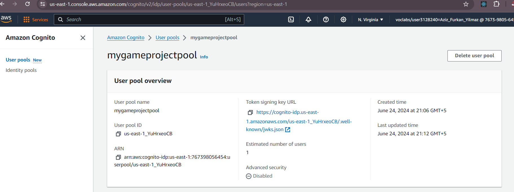

AWS Cognito, TicTacToe report
Name: Aziz Furkan YILMAZ
Course: Cloud Programming
Group: 
Date: 

Environment Architecture

The primary objective of this project was to integrate AWS Cognito for user authentication within a TicTacToe game application. The implementation encompassed setting up necessary AWS resources using Terraform, including infrastructure components like VPC, subnets, internet gateway, route tables, security groups, and deploying Dockerized frontend and backend services on EC2 instances.

AWS Cognito Setup
AWS Cognito was utilized extensively to manage user authentication processes within the application.

User Pool Creation:

Purpose: The user pool was created to handle user registration, sign-in, and user profile management.
Username Attributes: Configured to use email as the username attribute for unique user identification.
Password Policy: Defined with specific requirements such as minimum length, and mandatory inclusion of uppercase, lowercase, numbers, and symbols.
Schema Definition: Ensured that email was a required attribute in the user profile schema, enforcing consistency and usability.

User Pool Client Configuration:

Purpose: Configured a client application to interact securely with the user pool, enabling authentication functionalities within the application.
OAuth Configuration: Defined allowed OAuth scopes and flows necessary for application integration, including callback URLs and supported identity providers.

Authentication Flows:

Purpose: Enabled authentication flows such as user password authentication and refresh token authentication.
Functionality: Supported secure user authentication sessions and token management, ensuring robust security measures were in place for user interactions within the application.
Example Configuration:
Authentication Flows: ALLOW_USER_PASSWORD_AUTH, ALLOW_REFRESH_TOKEN_AUTH

Configured AWS Services

AWS Cognito User Pool Configuration:

EC2 Instance:

Running App:

What I Learned
This project provided comprehensive insights into AWS Cognito and its capabilities for managing user authentication in cloud-based applications. Key takeaways include:

Setting up AWS Cognito User Pool:

Learned how to create and configure a User Pool to handle user registration, sign-in, and management.
Customized user attributes and defined password policies to meet security requirements.
Configuring User Pool Client:

Configured a User Pool client to facilitate secure interactions between the application and Cognito.
Implemented OAuth flows and scopes to control access and authentication mechanisms.
Authentication Flows:

Enabled and configured authentication flows such as user password authentication and refresh token authentication.
Managed session tokens securely to ensure persistent and secure user sessions.
Integration with Backend Services:

Integrated AWS Cognito with backend services using JWT tokens for secure access and authorization.
Implemented token management strategies, including token refresh mechanisms for seamless user experience.
Obstacles Overcome
Configuration Challenges:

Understanding and correctly configuring AWS Cognito settings, including user attributes and password policies.
Addressing errors and inconsistencies during the setup of OAuth flows and client configurations.
Token Management:

Managing JWT tokens and implementing secure token storage mechanisms in the frontend and backend services.
Ensuring token validity and implementing token refresh logic to maintain active user sessions.
What Helped Most
Documentation and Resources:

Leveraging detailed AWS Cognito documentation and community forums for troubleshooting and best practices.
Exploring practical examples and tutorials to understand complex configurations and integration scenarios.
Terraform Infrastructure as Code:

Utilizing Terraform for provisioning AWS resources and infrastructure, providing a clear and structured approach to managing deployments.
Using Terraform's plan and apply features to validate and apply infrastructure changes, ensuring consistency and reliability.
Practical Implementation:

Hands-on experience in configuring and testing AWS Cognito settings within a real-world application context.
Iterative development and testing cycles to refine configurations and improve application security and usability.
Surprising Discoveries
Flexibility of AWS Cognito:

Surprised by the versatility and scalability of AWS Cognito in managing user authentication across various application types and scales.
Capability to handle complex authentication requirements and integrate seamlessly with other AWS services.
Integration Capabilities:

Smooth integration of AWS Cognito with frontend and backend services using standard protocols and APIs.
Ability to customize authentication workflows and enhance application security without extensive custom development.
Conclusion
In conclusion, this project significantly enhanced my proficiency in AWS Cognito and its application in cloud-based authentication solutions. The combination of hands-on implementation, detailed documentation, and infrastructure management with Terraform provided a comprehensive learning experience. Moving forward, these skills and insights will be invaluable in developing secure and scalable cloud applications that prioritize user authentication and data protection.
